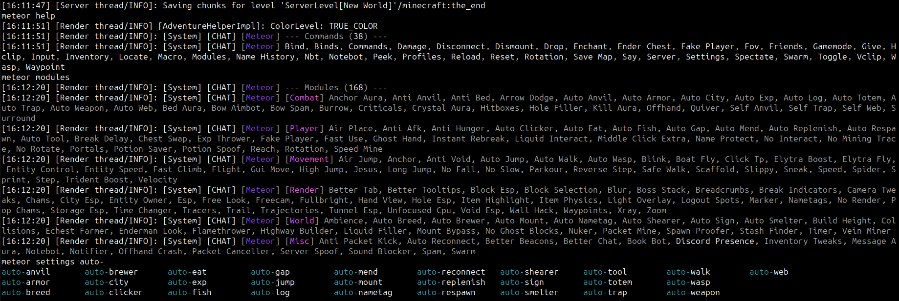
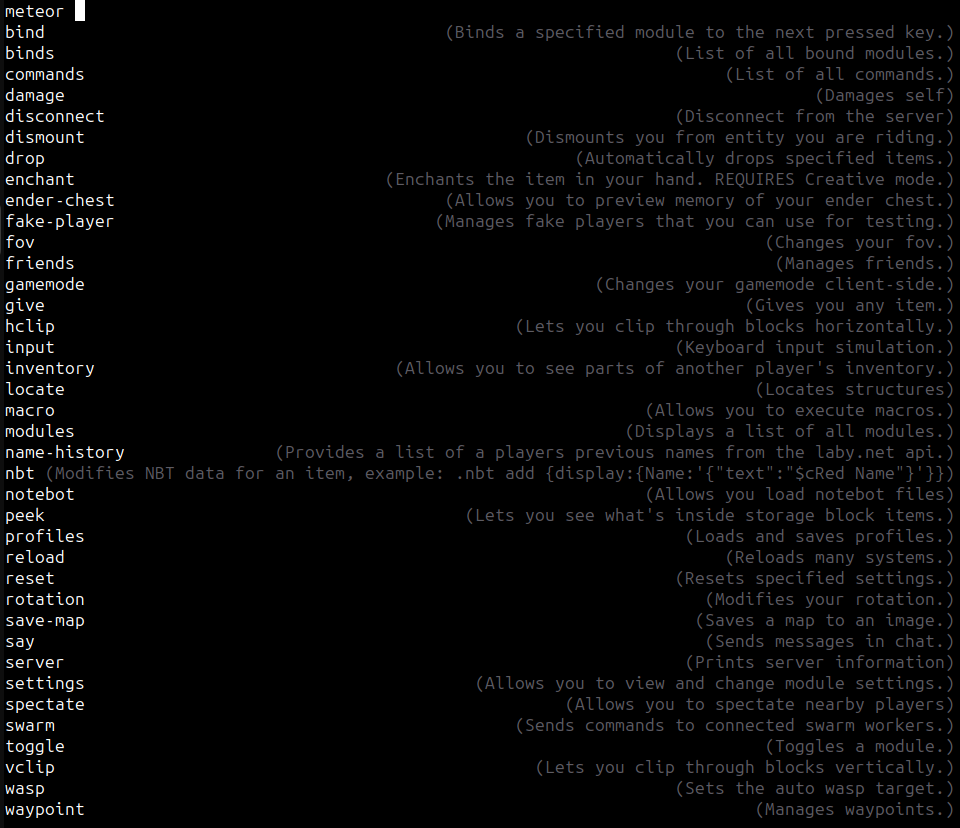

# HMC-Meteor
A 1.21.1 meteor Addon that adds a command for executing meteor commands in game to the [hmc-specifics](https://github.com/3arthqu4ke/hmc-specifics).
Also acts as a plugin for the [HeadlessMc](https://github.com/3arthqu4ke/headlessmc) launcher, where it also adds a meteor command,
to download the latest version of meteor.

